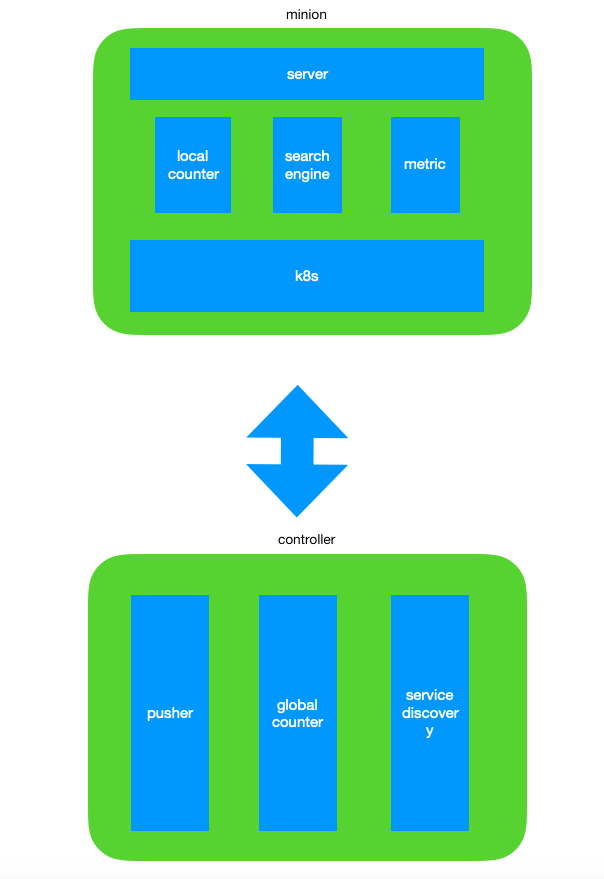

# mini-ads

Almost every Internet company gains money from ads, and almost each company have one or more business system to gains money from ads. However, I couldn't find any open-source project about ads delivery and ads management. Than I want to build one.

Every company have its special business logic, so I try to only write the common logics. If you want to use this product in your business, you might need to develop your special logic based on this product. Please let me know if you need my help. 

## Architecture

## TODOs
1. Use mmap system cal to load data.
2. To improve performance, partial data of Skiplist should be in memory, and partial data should be in disk.
3. Pusher should be a independent program to translate from order to reverted index data.
4. Support Ad server component.
5. Support Counter component.
6. Support Metric component.
7. Run within K8s platform.

## How To Contribute

## Reference